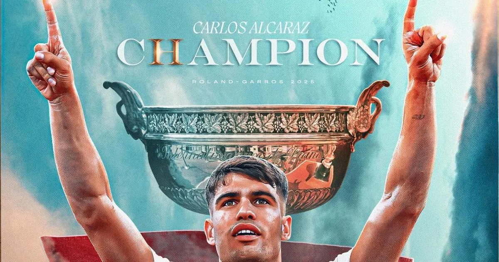
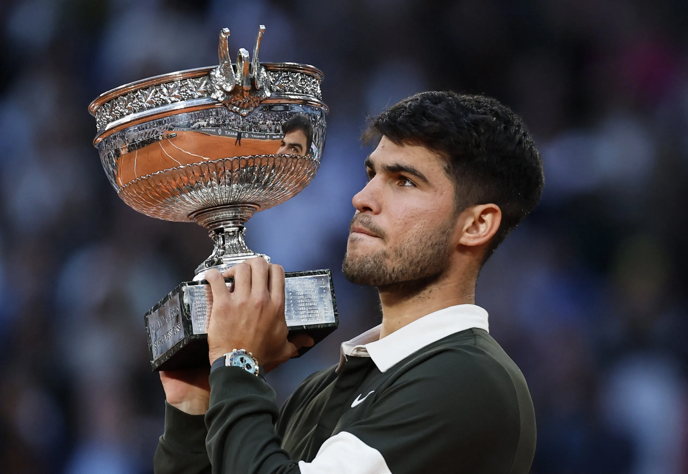
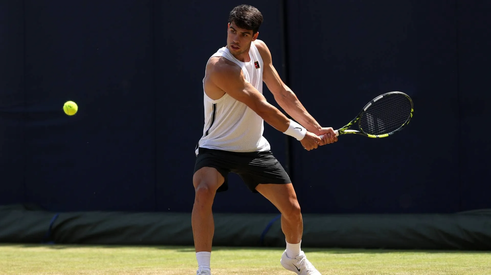
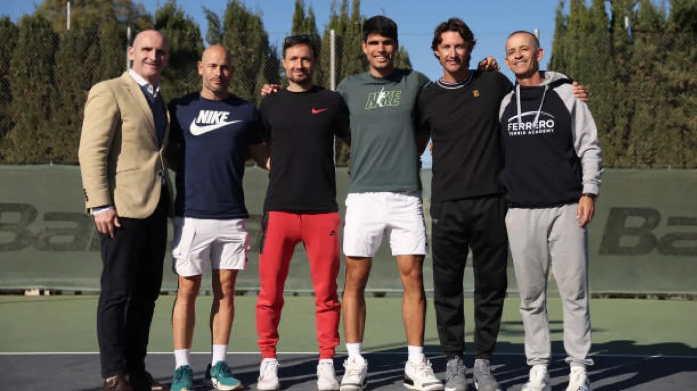
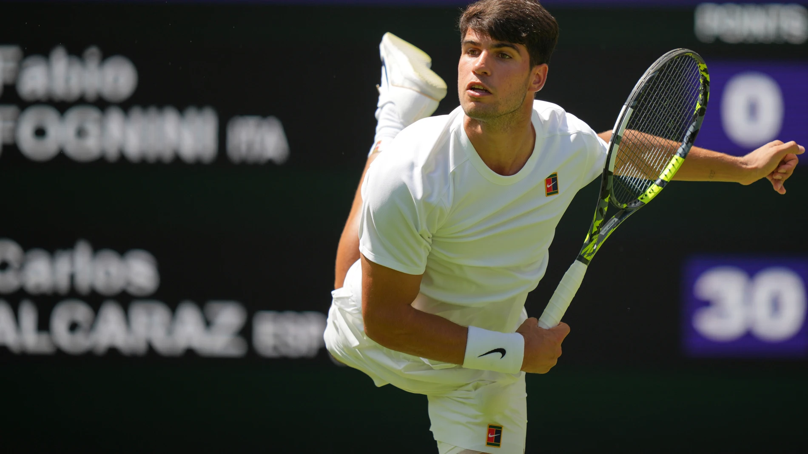
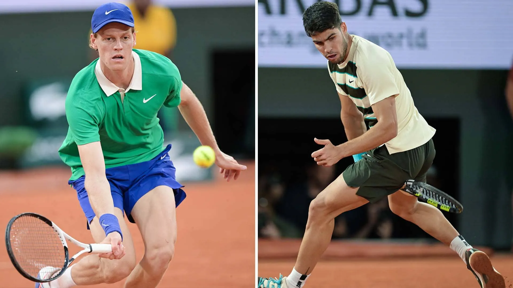

# 🎾 Carlos Alcaraz Garfia

[]

| **Dato** | **Información**|
|------------------------|-------------------------------------|
| 📅 **Nacido**| 5 mayo 2003, El Palmar (Murcia, España) |
| 📏 **Altura / Peso** | 1,83 m / 74 kg|
| 💼 **Profesional desde** | 2018 (15 años)|
| 🖐️ **Mano / Revés** | Diestro / 2 manos|
| 🏆 **Ranking ATP** | Actual: No. 2 (mayo 2025)   Histórico: No. 1 (36 semanas)|
| 💰 **Premios en 2025**| US $ 7,422,288 (42–5, 5 títulos)|
| 💰 **Premios carrera**| US $ 45,3 M (251–61, 21 títulos: 5 GS, 7 Masters)|
---

## 🏆 Temporada 2025

- **Grand Slam:** Defensor del título en Roland Garros 2025 (remontada épica 0–2 y salvando 3 bolas de campeonato en la final de 5 h 29 m)

- **Masters 1000:** Campeón en Monte‑Carlo (vs Musetti, su sexto título 1000) y Rome (vs Sinner, su séptimo) 

- **Otros títulos:** Queen’s Club (césped) e indoor en Rotterdam — primeros títulos en esas superficies.

- Logró títulos en las cuatro superficies (arcilla, césped, pista dura exterior e interior), siendo el más joven en la historia (21a 9m)

 

---

## 🖐 Equipo técnico y estilo de juego

- **Entrenadores:**  
  - Juan Carlos Ferrero (desde 2019)  
  - Samuel López (desde 2024) 
  

- **Estilo:**  
  - Velocidad, agresividad y gran cobertura de pista (comparado con Nadal y Djokovic)  
  - Golpe favorito: drive; revés sólido a dos manos  
  - Resiliente mentalmente, con recuperaciones históricas en situaciones límite  

---

## 🎥 Videos destacados

### 🎾 Wimbledon 2025 – 1ª ronda: Victoria épica de Carlos Alcaraz

Carlos Alcaraz protagonizó una impresionante victoria en la primera ronda de Wimbledon 2025 contra Fabio Fognini, en un partido maratónico que duró **4 horas y 37 minutos** y se decidió en cinco sets con un marcador de:

**7‑5, 6‑7, 7‑5, 2‑6, 6‑1**

---

**Detalles destacados:**

- **Duración:** 4 horas y 37 minutos de juego intenso.  
- **Condiciones:** Partido disputado bajo un calor agobiante y condiciones extremas que pusieron a prueba la resistencia física y mental de ambos tenistas.  
- **Momentos clave:** Alcaraz mostró una gran capacidad de recuperación tras perder el segundo y cuarto set, logrando imponer su juego en el set decisivo con un contundente 6-1.  
- **Asistencia especial:** Durante el partido, la multitud estuvo muy entregada, y se destacó la asistencia de un espectador que vivió la intensidad del encuentro muy de cerca, creando un ambiente electrizante.  

---

Esta victoria reafirma la fortaleza y versatilidad de Alcaraz en superficies de césped y su capacidad para sobreponerse a circunstancias adversas en partidos largos y exigentes.

- **Roland Garros 2025 – Final épica**: 🎾 Roland Garros 2025 – Final épica
En la final de Roland Garros 2025, se vivió una de las remontadas más impresionantes en la historia del tenis. El partido, que duró más de 5 horas, mostró no solo un nivel técnico extraordinario sino también una fortaleza mental sobresaliente por parte del ganador.

    Duración del partido: Más de 5 horas intensas de juego.

    Condiciones: Partido bajo condiciones exigentes, con cambios climáticos que pusieron a prueba la resistencia física de ambos jugadores.

    Momento clave: El jugador que remontó estaba dos sets abajo y logró dar vuelta el marcador gracias a una combinación de estrategia inteligente y una mentalidad implacable.

    Puntos memorables: Varios puntos de alta tensión que se definieron en largos rallies y donde el desgaste físico fue palpable.

    Impacto: Esta victoria se considera una de las más grandes remontadas en la historia de Roland Garros, demostrando que la perseverancia y el enfoque pueden superar cualquier obstáculo.

    Contexto:

    Este triunfo consolidó al campeón como uno de los grandes del tenis moderno, dejando una huella imborrable en el torneo y ofreciendo a los aficionados un espectáculo inolvidable.
 

